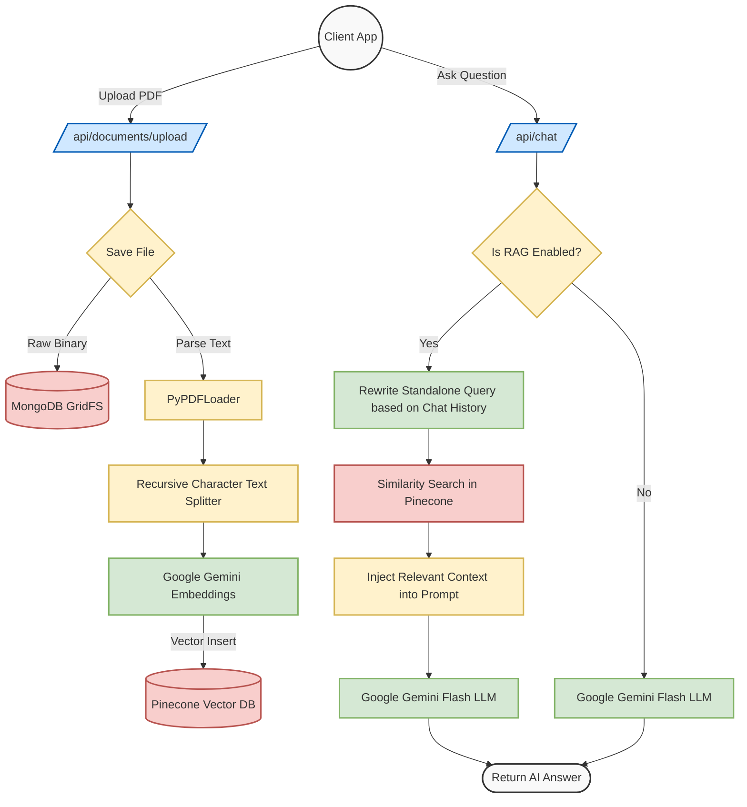

# Laganlakshmi AI Backend

This is the FastAPI backend for the Laganlakshmi AI Chatbot. It provides a highly optimized Retrieval-Augmented Generation (RAG) pipeline designed specifically for real estate inquiries, document summarization, and interactive chatting.

## 🚀 Technology Stack
- **Web Framework:** [FastAPI](https://fastapi.tiangolo.com/)
- **AI Framework:** [LangChain](https://python.langchain.com/)
- **LLM & Embeddings:** [Google Gemini (Generative AI)](https://ai.google.dev/)
- **Vector Database:** [Pinecone](https://www.pinecone.io/) (for similarity search)
- **Document Storage:** [MongoDB Atlas & GridFS](https://www.mongodb.com/products/platform/atlas-database) (for storing raw PDFs asynchronously via Motor)

---

## 🏗 System Architecture & Flowchart



---

## 🛠 Local Development Setup

### 1. Prerequisites
- Python 3.9+ 
- A MongoDB Atlas account.
- A Pinecone account.
- A Google Gemini API Key.

### 2. Installation
Create a virtual environment and install the dependencies:
```bash
python -m venv venv
source venv/bin/activate  # On Windows use: venv\Scripts\activate
pip install -r requirements.txt
```

### 3. Environment Variables
Copy the example environment file and fill in your actual keys:
```bash
cp .env.example .env
```
Ensure your `.env` looks like this:
```env
GEMINI_API_KEY="your-gemini-api-key"
PINECONE_API_KEY="your-pinecone-api-key"
PINECONE_INDEX_NAME="real-estate"
MONGODB_URL="mongodb+srv://<username>:<password>@cluster0..."
MONGODB_DB_NAME="laganlakshmi"
```

### 4. Running the Server
```bash
python main.py
```
The server will start on `http://0.0.0.0:8000`. You can access the auto-generated Swagger UI documentation at `http://0.0.0.0:8000/docs`.

---

## 🌍 Deployment on Render

This backend is pre-configured to be deployed as a **Web Service** on [Render.com](https://render.com/).

1. Connect your GitHub repository to a new Render Web Service.
2. Set the following build configurations:
   - **Environment:** `Python`
   - **Root Directory:** `backend`
   - **Build Command:** `pip install -r requirements.txt`
   - **Start Command:** `python main.py`
3. Add your Environment Variables in the Render dashboard.
4. Deploy! Render will automatically bind to the dynamic `$PORT`.
